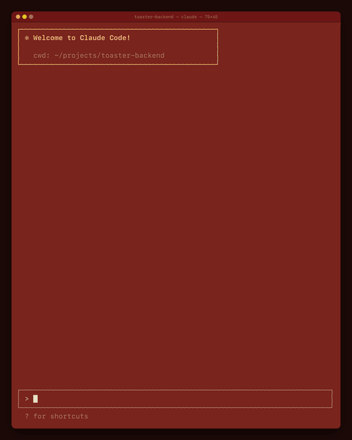

# Invaders for Claude Code

A tiny Space Invaders you play above the prompt while Claude works. It pauses when
Claude finishes, saves your wave and score, and draws in your terminal's own colors.
Playing never interrupts Claude.



[Watch the 30-second video](promo/invaders-promo.mp4)

```
invaders/          the mod (a Claude Code plugin)
promo/             a short video and GIF of the game
.claude-plugin/    marketplace.json, so this folder can be installed as a marketplace
```

## Install

Needs a Claude Code recent enough to run mods (built against 2.1.288).

**Install it like any plugin**, inside Claude Code:

```
/plugin marketplace add nison/claude-invaders
/plugin install invaders@cli-mods
```

Then type `/invaders` and click the board to play. Update later with
`claude plugin update invaders@cli-mods`.

**If `/invaders` is not found** after installing, quit Claude Code and start it again;
a session that was already running, and sometimes the first new one, does not load a
newly installed mod. If it is still missing, your Claude Code may not have mods switched
on yet: update to the latest version, or start it with
`CLAUDE_CODE_ENABLE_FUNCTION_HOOKS=1 claude`.

**Or load it for one session** from a clone of this repository:

```
claude --plugin-dir ./invaders
```

**To keep editing it with live reload:** in a session, ask Claude to work on the
mod (the plugin-authoring skill), copy `invaders/` into the session's mods folder it
names, and accept "Enable hot reloading for this session". Copy changes back here.

## Play

| | |
| --- | --- |
| `/invaders` | open the game (space to start, p to pause, h to hide, q to close; progress is saved) |
| `/invaders ask` | offer a game while Claude works, at most twice a day (default) |
| `/invaders auto` | open it by itself instead, at most twice a day |
| `/invaders off` | only open it with `/invaders` |
| `/invaders band` | play above the prompt, on the terminal's own background (default) |
| `/invaders dock` | play in a pane beside the chat, full height, in Claude Code's pane color |
| `/invaders reset` | start over from wave 1 |
| `/invaders intro` | play the start screen again (it plays by itself the first time the game is opened) |
| `/invaders close` | close the game |
| `/invaders help` | list the commands and keys |

Keys: ←/→ (or a/d) move, tap for 2 cells, hold to glide; space fires (up to 3 shots);
p pauses; h hides the board down to one line, paused, and h shows it again; q closes.

By default the game plays in the band above the prompt, on the terminal's own
background, so it follows whatever profile the terminal uses. Click the board to
play: the click gives it the keys and starts the game (Claude Code only hands a
band the keyboard on a click); Esc hands them back to the prompt and q closes the game. The band
is at most half the terminal's height, so the board is shorter there and needs a
terminal of about 32 rows.

`/invaders dock` plays in a pane instead: beside the chat at full height when the
terminal is 110+ columns wide in the fullscreen layout, above the prompt when
narrower. Esc closes it. Claude Code paints a docked pane in its own theme's color,
not the terminal's.

## Develop

From `invaders/`:

```
claude plugin validate .
claude plugin test .
npx -y -p typescript@5 tsc -p .     # after the mod has loaded once (writes .claude-plugin/types)
```

## License

MIT. See [LICENSE](LICENSE).
